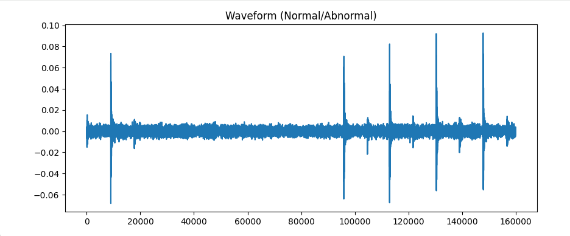
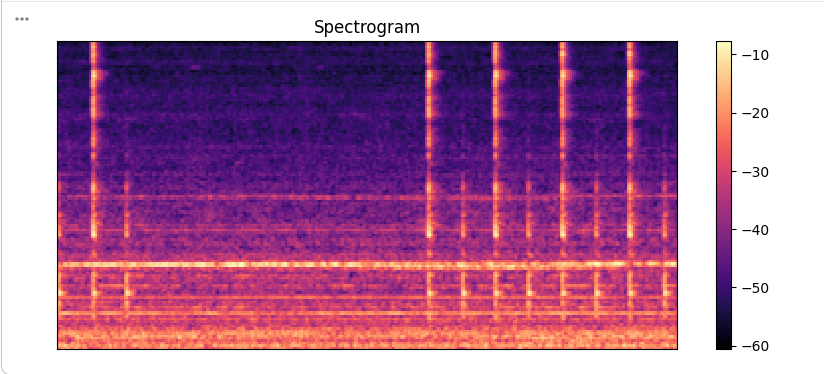

# 🏭 Industrial Machine Investigation AI

## 📌 Overview
This project is an AI-based system for detecting industrial machine faults using acoustic signal processing, Machine Learning, and Deep Learning (CNN). It classifies machine sound signals into **Normal** and **Abnormal** conditions for predictive maintenance.

---

## 📊 Dataset
The dataset contains audio signals of industrial machines labeled as:
- Normal
- Abnormal

---

## 🧠 Technologies Used
- Python 🐍
- Librosa 🎵
- NumPy
- Pandas
- Matplotlib & Seaborn
- Scikit-learn
- TensorFlow / Keras

---

## 🔄 Project Workflow
- Data Loading
- Exploratory Data Analysis (EDA)
- Feature Extraction (MFCC)
- Machine Learning Model (Random Forest)
- Deep Learning Model (CNN)
- Model Evaluation

---

## 📊 Visualizations

### 🎧 Waveform

---

### 🎵 Spectrogram

---

### 📊 Class Distribution

---

### 📈 Audio Length Distribution

---

### 🔗 Feature Correlation

---

### 🤖 Model Accuracy

---

### 📉 Model Loss

---

### 📊 Confusion Matrix (ML)

---

### 🤖 CNN Confusion Matrix

---

## 📈 Results

- Best Model: CNN

---

## 📁 Project Structure

images/
├── Audio Length Distribution.PNG
├── CNN Confusion Matrix.PNG
├── Class Distribution.PNG
├── Confusion Matrix.PNG
├── Feature Correlation.PNG
├── Model Accuracy.PNG
├── Model Loss.PNG
├── Spectrogram.PNG
├── Waveform.PNG

---

## 🚀 How to Run
pip install -r requirements.txt
python main.py

OR run in Google Colab / Jupyter Notebook.

---

## ⭐ Future Improvements
Real-time fault detection system  
Web dashboard (Streamlit/Flask)  
Deployment as API  

---
## 👨‍💻 Author  

Hamdan-Saddique-ai  
